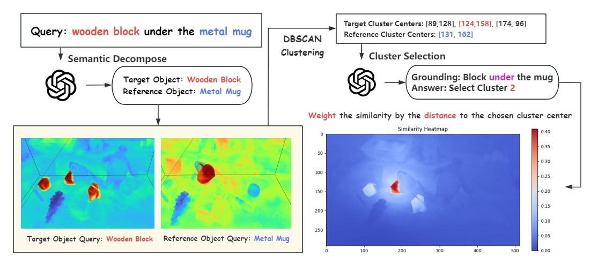

## Abstract

We replicate the paper called 'Distilled Feature Field Enable Few-Shot Language-Guided Manipulation'. We identify a research problem that the original paper can only handle simple language query, but can't ground the scene objects correctly when the language queries become complex and compositional due to the **bag-of-word problem with CLIP**. We develop a grounding decomposition algorithm to ground more complex languages to the objects in the 3D distilled feature field.

<div class="center-image">

</div>
<!-- <div class="center-image">

</div> -->

## Methodology
To introduce our methodology in a high level, we first decompose the complex and compositional query into an atomic level, by prompting the GPT-4 to identify the target object as well as the metal mug. Then we query those objects separately to the feature field, and obtain the candidate points. Next, we use DBSCAN clustering algorithm to classify the points according to their spatial positions. After that, we prompt the GPT-4 to select the cluster we want, and weigh the similarity accoding to the distance to the clusters. Finally, we ground the complex and compositional query to the expected object in the feature field.

## Result
The baseline model simply encodes the query language with CLIP, and calculate the cosine similarity with the feature vectors. However, the CLIP embedding can't handle complex and compositional relationship due to CLIP's bag-of-word behaviours. The output results from the baseline model is noisy and incorrect, while our algorithm can output clear and correct results, showcasing a much stronger language-grounding ability. Below are several demos.

### Complex queries consisting of targets, reference, and relationship
- Query: wooden block under the metal mug. **(Left) Baseline (Right) Ours**
<div style="display: flex; ; justify-content: center;">
    
    
</div>


- Query: wooden block closest to the apple. **(Left) Baseline (Right) Ours**
<div style="display: flex; ; justify-content: center;">
    
    
</div>


- Query: mug furthest to the bear. **(Left) Baseline (Right) Ours**
<div style="display: flex; ; justify-content: center;">
    
    
</div>

- Query: block under the pink mug. **(Left) Baseline (Right) Ours**
<div style="display: flex; ; justify-content: center;">
    
    
</div>

- Query: mug furthest to the bear. **(Left) Baseline (Right) Ours**
<div style="display: flex; ; justify-content: center;">
    
    
</div>

### Grounding with only target objects without any other reference

- Query: right baymax. **(Left) Baseline (Right) Ours**
<div style="display: flex; ; justify-content: center;">
    
    
</div>

- Query: wooden block at the left. **(Left) Baseline (Right) Ours**
<div style="display: flex; ; justify-content: center;">
    
    
</div>

### Multi-view Rendering
We can render and ground the language from any views. For example, we can show a demo for grounding a view from above.

<div style="display: flex; ; justify-content: center;">
    
</div>

### Limitations
GPT-4 can sometimes hallucinate with spatial relationship reasoning. For example, the GPT-4 may understand the "under" from a 2D image view, instead of a 3D spatial sense. In the following picture, the selected block is "under" the mug if we consider their 2D coordinates in this image. However, it's not the "under" we really mean in a 3D space.

<div style="display: flex; ; justify-content: center;">
    
</div>

## Project Video Demo
<div class="video-wrap">
  <div class="video-container">
    <video controls title="Video title" width="100%" height="auto">
      <source src="{{ site.baseurl }}/assets/projects/reports/f3rm/demo.mp4" type="video/mp4">
      Your browser does not support the video tag.
    </video>
  </div>
</div>

## Citation

If you found our work helpful, consider citing us with the following BibTeX reference:

```
@article{yinong2023deeprob,
  title = {Enhance Distilled Feature Field for Better Language Grounding},
  author = {Yinong He, Yixiang Dai, Huijie Tang},
  year = {2023}
}
```

## Contact

If you have any questions, feel free to contact [Yinong](heyinong@umich.edu).
